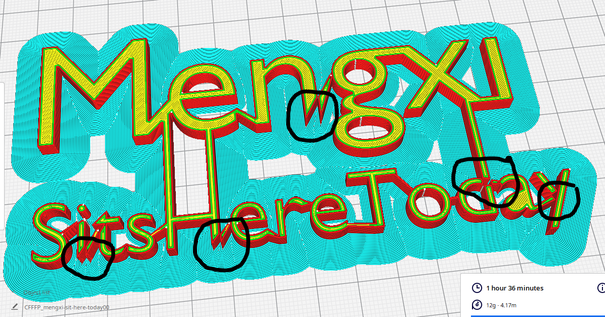

# Faces within a mesh
When having faces within the body of a mesh, Cura seems trying to separate/empty the inner space of the mesh body which is separated by the faces. Therefore, some parts of the mesh body are missing after slicing.

 

# To fix the issue
1. Select the mesh and enter `Edit Mode`
2. Select the intersect faces that go into the mesh body
3. Click on tab `Face` --> `Intersect (Knife)`, this should add the vertices and the edge of the intersect of the faces
4. Delete the intersect faces
5. Fill the surfaces of the mesh beside the edge of the intersect
