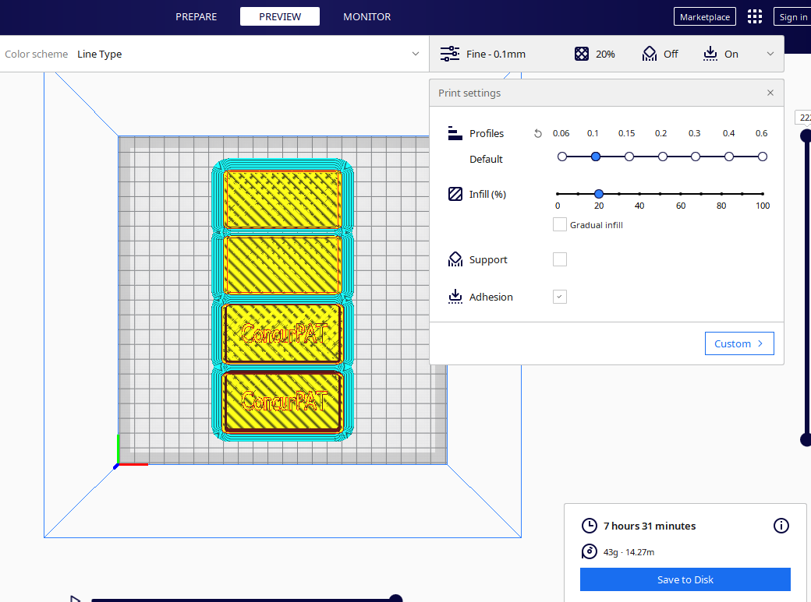

# Print faster with objects closer to each other

But not that much in this case (3min from total 7h30min lol)~

## Before

## After

## Also it prints faster when printing things together
- Estimated time to print the 2 covers only: 2h54m
- Estimated time to print the 2 cases without covers: 5h12m
- Estimated time to print the 2 cases with covers: 8h2m < 8h6m (sum of the 2 tasks above)
