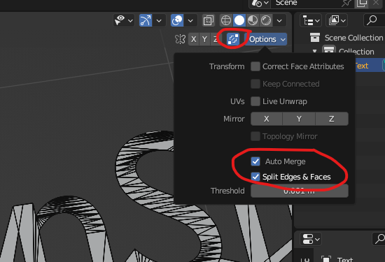

# Intersect Lines
Use the auto-merge feature.

## Set up
Enable auto merge and check both `Auto Merge` and `Split Edges & Faces` as:

## Action
1. Select the relevant line or vertex (even one is sufficient).
2. Press `g` and then press enter (or left click) to take effect.
